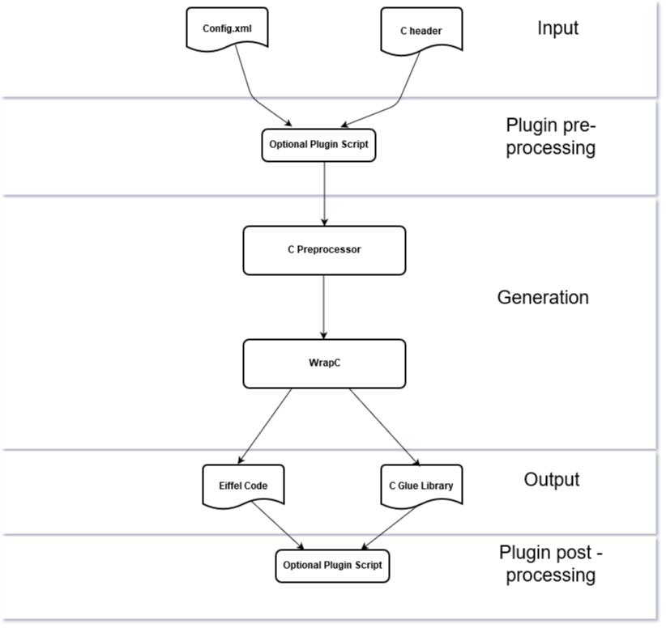
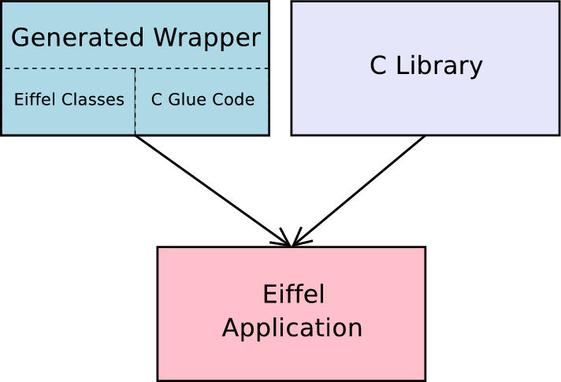

# Getting Started with WrapC

##### Table of Contents  
* [Install WrapC](#installation)
* [Understanding WrapC](#understanding_wrapc)
	*  [Command Line Options](#commands)
	*  [The Generated Code](#gencode)  
	*  [Example of use](#tooluse)
* [Eiffel Generated Code](#eiffel_gen_code)
	*  [Enums](#enums)
	*  [Structs/Unions](#structs)  
	*  [Functions](#functions)
	*  [Callbacks](#callbacks)
	*  [Macros](#macros)
* [The configuration file](#config_file)
	*  [Dependent Types](#dependent_types)


<a name="installation"></a>
# Install WrapC
If you didn't install the tool, check the install section [here](./developer/Readme.md#installation)

<a name="understanding_wrapc"></a>
# Understanding WrapC

This section describes what code `WrapC` generates and how to integrate that code into a automated build system.

<a name="commands"></a>
## Command Line Options

The wrap_c tool is a command line application and takes the following command line parameters:

	wrap_c: You must specify '--full-header=<...>'
	usage: wrap_c   [--version] [--verbose]
                [--c_compile_options=<...>] [--script_pre_process=<...>] [--script_post_process=<...>]
		[--output-dir=<...>] --full-header=<...> [--config=<...>]

	options:
		--version ... Output WrapC (EWG) version number.
		--verbose ... Output progress information on STDOUT
		--c_compile_options: Optional c compile options
		--script_pre_process: Optional pre-processing script, to be executed before C header preprocessing
		--scrtip_post_process: Optional post-processing script, to be executed after Eiffel code wrapping.

	arguments:
		--output-dir  ... Directory where generated files will be placed
		--full-header ... Filename (including pathname) to the C header to be preprocessed,
			          and name of header file, that should be used in eiffel external clauses
		--config      ... Name of config file to use. A config file allows to customize the wrapping process

You can use `wrap_c` directly to see what it produces on a header  of your own without setting up a complete project, or use your own build process. Most of the time you will not use the `wrap_c` tool directly, but use it indirectly through geant as an example.

<a name="tooluse"></a>
## Example of use

### Simple example
	wrap_c --verbose --output-dir=C:/home/test/ewg/example/simple/library   full-header=C:/home/test/ewg/example/simple/library/manual_wrapper/c/include/simple_header.h --config=C:/home/test/ewg/example/simple/library/config.ewg

### Simple example with Post Processing Script
	wrap_c --verbose --output-dir=C:/home/test/ewg/example/simple/library --script_post_process= C:/home/test/ewg/example/simple/library/postscript.py  --full-header=C:/home/test/ewg/example/simple/library/manual_wrapper/c/include/simple_header.h  
	--config=C:/home/test/ewg/example/simple/library/config.ewg

<a name="gencode"></a>
## The Generated Code

As shown in the next figure, `WrapC` takes C header file which will be preprocessed and generates Eiffel classes and a C glue code library, based on the rules defined in the configuration `config.xml`. Optionally `WrapC` can use plugin scripts to do some pre processing, before to do the C preprocessing and Eiffel Code generation and after the code generation with the plugin post processing.

The generation of the C glue code library, is needed for C callbacks, it might seem a little counter productive at first, since we really want to use Eiffel not C. But first of all this generated C code makes accessing the C library from Eiffel possible (at least for C callbacks) and second of all this generated C code is wrapped by the generated Eiffel classes as well, eliminating the need to deal with it directly.



An application that uses the WrapC wrapper uses the generated Eiffel Classes optionally Manual wrapped code and links against the generated glue code library as well as to the C library.



WrapC creates a whole directory structure containing generated source code.

The following shows the directory structure generated by WrapC

	generated_wrapper
		c 		-- C source code for c glue library (needed for callbacks).
			include -- C headers.
			src	-- C implementation.
		eiffel  -- Eiffel classes

<a name="eiffel_gen_code"></a>
# Eiffel Generated Code
This sections describes what code gets generated for C enum, struct, unions, functions declarations and how to use them.

<a name="enums"></a>
## Enums

Here we describe what code gets generated for a C enum declaration and how to use that code.
Let us look at the following enum declaration (taken from the simple-example) defined in the header `simple_header.h`

    typedef enum
    {
    	red,
    	blue,
    	green
    } colors;

colors is an alias for an anonymous enum. WrapC generates an Eiffel wrapper class for it in the cluster `eiffel` :

	class COLORS_ENUM_API

	feature {ANY}

		is_valid_enum (a_value: INTEGER): BOOLEAN
				-- Is `a_value' a valid integer code for this enum ?
			do
				Result := a_value = red or a_value = blue or a_value = green
			end

		red: INTEGER
			external
				"C inline use <simple_header.h>"
			alias
				"red"
			end

		blue: INTEGER
			external
				"C inline use <simple_header.h>"
			alias
				"blue"
			end

		green: INTEGER
			external
				"C inline use <simple_header.h>"
			alias
				"green"
			end

	end


The name of the class is `COLORS_ENUM_API`. Since Eiffel does not have the enum concept, enums are mapped as INTEGER in Eiffel. Simply inherit from `COLORS_ENUM_API` wherever you want to use them or just use it as a client.

<a name="structs"></a>
## Structs and Unions

Here we describe what code gets generated for a C struct declaration and how to use that code to create, free, read from and write to a struct. Unions are wrapped in a similar way.

For structs `WrapC` generates a class with a low level layer using [inline externals](https://www.eiffel.org/doc/solutions/Interfacing_with_C_and_C%2B%2B#Inline_externals) and a high level access using the low level features to provide object oriented access. Every struct wrapper class inherits from `MEMORY_STRUCTURE` which is a deferred class with the following interface part of EiffelBase library:

	deferred class interface
		MEMORY_STRUCTURE

	feature -- Initialization

		make
				-- Initialize current with given structure_size.
			ensure
				not_shared: not shared

		make_by_pointer (a_ptr: POINTER)
				-- Initialize current with `a_ptr`.
			require
				a_ptr_not_null: a_ptr /= default_pointer
			ensure
				shared: shared

	feature -- Access

		item: POINTER
				-- Access to memory area.

		shared: BOOLEAN
				-- Is current memory area shared with others?

	feature -- Measurement

		structure_size: INTEGER_32
				-- Size to allocate (in bytes).
			ensure
				is_class: class
				positive_result: Result > 0

	feature -- Status report

		exists: BOOLEAN
				-- Is allocated memory still allocated?

	invariant
		managed_pointer_valid: not shared implies managed_pointer /= Void
		internal_item_valid: shared implies internal_item /= default_pointer
	end

The low level implementation are purely procedural but still provide full access to C structs.
The high level access on the other hand provide an object oriented way to handle structs.

Let's look at the following struct declaration (taken from simple example) defined in the header `simple_header.h`

	struct foo
	{
	  int a,b,*pc;
	};

`WrapC` will generate the following Eiffel class

	class FOO_STRUCT_API
	inherit

		MEMORY_STRUCTURE
	create

		make,
		make_by_pointer

	feature -- Measurement

		structure_size: INTEGER
			do
				Result := sizeof_external
			end

	feature {ANY} -- Member Access

		a: INTEGER
				-- Access member `a`
			require
				exists: exists
			do
				Result := c_a (item)
			ensure
				result_correct: Result = c_a (item)
			end

		set_a (a_value: INTEGER)
				-- Change the value of member `a` to `a_value`.
			require
				exists: exists
			do
				set_c_a (item, a_value)
			ensure
				a_set: a_value = a
			end

		b: INTEGER
				-- Access member `b`
			require
				exists: exists
			do
				Result := c_b (item)
			ensure
				result_correct: Result = c_b (item)
			end

		set_b (a_value: INTEGER)
				-- Change the value of member `b` to `a_value`.
			require
				exists: exists
			do
				set_c_b (item, a_value)
			ensure
				b_set: a_value = b
			end

		pc: POINTER
				-- Access member `pc`
			require
				exists: exists
			do
				Result := c_pc (item)
			ensure
				result_correct: Result = c_pc (item)
			end

		set_pc (a_value: POINTER)
				-- Change the value of member `pc` to `a_value`.
			require
				exists: exists
			do
				set_c_pc (item, a_value)
			ensure
				pc_set: a_value = pc
			end

	feature {NONE} -- Implementation wrapper for struct struct foo

		sizeof_external: INTEGER
			external
				"C inline use <simple_header.h>"
			alias
				"sizeof(struct foo)"
			end

		c_a (an_item: POINTER): INTEGER
			require
				an_item_not_null: an_item /= default_pointer
			external
				"C inline use <simple_header.h>"
			alias
				"[
					((struct foo*)$an_item)->a
				]"
			end

		set_c_a (an_item: POINTER; a_value: INTEGER)
			require
				an_item_not_null: an_item /= default_pointer
			external
				"C inline use <simple_header.h>"
			alias
				"[
					((struct foo*)$an_item)->a =  (int)$a_value
				]"
			ensure
				a_set: a_value = c_a (an_item)
			end

		c_b (an_item: POINTER): INTEGER
			require
				an_item_not_null: an_item /= default_pointer
			external
				"C inline use <simple_header.h>"
			alias
				"[
					((struct foo*)$an_item)->b
				]"
			end

		set_c_b (an_item: POINTER; a_value: INTEGER)
			require
				an_item_not_null: an_item /= default_pointer
			external
				"C inline use <simple_header.h>"
			alias
				"[
					((struct foo*)$an_item)->b =  (int)$a_value
				]"
			ensure
				b_set: a_value = c_b (an_item)
			end

		c_pc (an_item: POINTER): POINTER
			require
				an_item_not_null: an_item /= default_pointer
			external
				"C inline use <simple_header.h>"
			alias
				"[
					((struct foo*)$an_item)->pc
				]"
			end

		set_c_pc (an_item: POINTER; a_value: POINTER)
			require
				an_item_not_null: an_item /= default_pointer
			external
				"C inline use <simple_header.h>"
			alias
				"[
					((struct foo*)$an_item)->pc =  (int*)$a_value
				]"
			ensure
				pc_set: a_value = c_pc (an_item)
			end

	end

To use this wrappper just use it as a client or inherit from `FOO_STRUCT_API`. The following code snippet demonstrates how to use the struct wrapper class.


	example_struct_foo
		local
			foo: FOO_STRUCT_API
				-- Wrapper object for `struct foo'
		do
				-- Create a new struct of type 'struct foo'
				-- `unshared' means that when `foo' will get
				-- collected, the struct it wrapps will be
				-- freed.
			create foo.make

				-- Set members `a' and `b'.
				-- Note that `a' and `b' are real
				-- members of struct foo.
			foo.set_a (33)  -- (1) High level access: set struct member
			foo.set_b (75)   	 	

				-- Output the members
			print ("foo.a (33): " + foo.a.out + "%N")  -- (2) High level access: read struct member
			print ("foo.b (75): " + foo.b.out + "%N")
		end

(1) In this case we use our high level access to the STRUCT_API that will use the low level implementation in this case the following code will be called form te feature `FOO_STRUCT_API.set_a`

	 set_c_a (an_item: POINTER; a_value: INTEGER)
		require
			an_item_not_null: an_item /= default_pointer
		external
			"C inline use <simple_header.h>"
		alias
			"[
				((struct foo*)$an_item)->a =  (int)$a_value
			]"
		ensure
			a_set: a_value = c_a (an_item)
		end

(2) Similar to (1)  but to read a member value in this case `a`, the low level implmentation to be called from `FOO_STRUCT_API.a`


	c_a (an_item: POINTER): INTEGER
		require
			an_item_not_null: an_item /= default_pointer
		external
			"C inline use <simple_header.h>"
		alias
			"[
				((struct foo*)$an_item)->a
			]"
		end

<a name="functions"></a>
## Functions

This section describes what code gets generated for a C function declaration and how to use that code to call the declared function.
Let us look at the following function declarations (taken from the simple-example)

	void func1 (int a, int b);
	int func2 (int a, int b);

func1 is a function that takes two parameters of type int and and does not return a value
func2 is a function that takes two parameters of type int and returns a value of type int.

`WrapC` generates an Eiffel wrapper class like this

	class SIMPLE_HEADER_FUNCTIONS_API

	feature -- Access

		func1 (a: INTEGER; b: INTEGER)
			external
				"C inline use <simple_header.h>"
			alias
				"[
					func1 ((int)$a, (int)$b);
				]"
			end

		func2 (a: INTEGER; b: INTEGER): INTEGER
			external
				"C inline use <simple_header.h>"
			alias
				"[
					return func2 ((int)$a, (int)$b);
				]"
			end
	end		

The name of the class is `SIMPLE_HEADER_FUNCTIONS_API`. This is because the function declarations comes from the C header file `simple_header.h`. `WrapC` will put all function declarations from the same header in the same class.

`func1`, `func2` are the features you will want to call if you want to execute the c function `func1` and `func2`.

<a name="callbacks"></a>
## Callbacks

This section describes what code gets generated for C callbacks and how to use that code. Now first of all its not as trivial to define what a callback is. `WrapC` defines callbacks as pointers to functions. Wherever it sees a pointer to a function, it generates a callback wrapper. Of course chances are some pointers to functions are not meant to be callbacks, but in this case we can simply ignore the generated code.

It is important to understand that there is an inherent problem when wrapping callbacks in Eiffel. For example the following callback:

	typedef void (*void_callback) (void);

Does not convey any state when invoked (other than it has been invoked). This is the reason for the following limitation: so by default one can only register one Eiffel callback receiver per callback type (more about this later). If more receivers were allowed how would one decide on the invocation of a callback which receiver is meant? In practice this limitation is usually of no concern. Most C libraries have adopted a pseudo OO technique of supplying a user definable parameter as the first parameter on every callback. This parameter can be used to do further dispatching.

Let us look at the following declarations (taken from the callback-example)

    typedef void (*sample_callback_type) (void* pdata, int a_event_type);

    // make `sample_callback_type' receive events.
    void register_callback (sample_callback_type a_callback, void* pdata);

    // make all registered callbacks receive an event
    void trigger_event (int a_event_type);

`sample_callback_type` is the actual callback. `register_callback` is used to register a given callback receiver, so that it gets called whenever one calls `trigger_event`. The two function declarations are wrapped as usual. For `sample_callback_type` `WrapC` generates two classes both are located in `eiffel` cluster and also generates an special C glue code for callbacks support. The two classes of interest are `SAMPLE_CALLBACK_TYPE_DISPATCHER` and `EWG_CALLBACK_CALLBACK_C_GLUE_CODE_FUNCTIONS_API`.

The first one is the one you have to create in order to establish the C-Eiffel bridge and register via an agent the Eiffel feature that you want to call on a callback. The second one is the Eiffel wrapper of the C glue code generated needed to implement callbacks.

First let's check generated dispatcher class for our example


	class SAMPLE_CALLBACK_TYPE_DISPATCHER

	inherit

		EWG_CALLBACK_CALLBACK_C_GLUE_CODE_FUNCTIONS_API
			export {NONE} all end
		DISPOSABLE

	create
		make

	feature -- Initialization
	
		make
				-- Dispatcher initialization.
			do
				set_sample_callback_type_object ($Current)
			end

	feature -- Access: Routine 

		routine_1: detachable PROCEDURE [TUPLE [a_pdata: POINTER; a_a_event_type: INTEGER]] 
			--Eiffel routine to be call on callback.

		routine_2: detachable PROCEDURE [TUPLE [a_pdata: POINTER; a_a_event_type: INTEGER]] 
			--Eiffel routine to be call on callback.

		routine_3: detachable PROCEDURE [TUPLE [a_pdata: POINTER; a_a_event_type: INTEGER]] 
			--Eiffel routine to be call on callback.

	feature -- Access: Dispatcher

		c_dispatcher_1: POINTER
				-- The dispatcher `c_dispatcher_1` is connected to a C function,
				-- that can be given to the C library as a callback target
				-- and on the other hand the Eiffel feature `on_callback_1`
				-- When its C function gets called, the dispatcher
				-- calls`on_callback_1`on the Eiffel side.
			do
				Result := get_sample_callback_type_stub_1
			end

		c_dispatcher_2: POINTER
				-- The dispatcher `c_dispatcher_2` is connected to a C function,
				-- that can be given to the C library as a callback target
				-- and on the other hand the Eiffel feature `on_callback_2`
				-- When its C function gets called, the dispatcher
				-- calls`on_callback_2`on the Eiffel side.
			do
				Result := get_sample_callback_type_stub_2
			end

		c_dispatcher_3: POINTER
				-- The dispatcher `c_dispatcher_3` is connected to a C function,
				-- that can be given to the C library as a callback target
				-- and on the other hand the Eiffel feature `on_callback_3`
				-- When its C function gets called, the dispatcher
				-- calls`on_callback_3`on the Eiffel side.
			do
				Result := get_sample_callback_type_stub_3
			end

	feature -- Access: Callback

		on_callback_1 (a_pdata: POINTER; a_a_event_type: INTEGER)  
				-- Callback target.
			do
				if attached routine_1 as l_routine then 
					l_routine (a_pdata, a_a_event_type)
				end
			end

		on_callback_2 (a_pdata: POINTER; a_a_event_type: INTEGER)  
				-- Callback target.
			do
				if attached routine_2 as l_routine then 
					l_routine (a_pdata, a_a_event_type)
				end
			end

		on_callback_3 (a_pdata: POINTER; a_a_event_type: INTEGER)  
				-- Callback target.
			do
				if attached routine_3 as l_routine then 
					l_routine (a_pdata, a_a_event_type)
				end
			end

	feature -- Access: Status Report

		is_callback_1_available: BOOLEAN
				-- Is callback available?
			do
				Result := routine_1 = Void 
			end

		is_callback_2_available: BOOLEAN
				-- Is callback available?
			do
				Result := routine_2 = Void 
			end

		is_callback_3_available: BOOLEAN
				-- Is callback available?
			do
				Result := routine_3 = Void 
			end

	feature -- Register: Callbacks

		register_callback_1 (a_routine: like routine_1)
				-- Register callback target `a_routine`.
			require
				is_callback_1_unset: is_callback_1_available
			do
				routine_1 := a_routine
				set_sample_callback_type_entry_1 ($on_callback_1)
			ensure
				callback_1_set: attached routine_1
			end

		register_callback_2 (a_routine: like routine_1)
				-- Register callback target `a_routine`.
			require
				is_callback_2_unset: is_callback_2_available
			do
				routine_2 := a_routine
				set_sample_callback_type_entry_2 ($on_callback_2)
			ensure
				callback_2_set: attached routine_2
			end

		register_callback_3 (a_routine: like routine_1)
				-- Register callback target `a_routine`.
			require
				is_callback_3_unset: is_callback_3_available
			do
				routine_3 := a_routine
				set_sample_callback_type_entry_3 ($on_callback_3)
			ensure
				callback_3_set: attached routine_3
			end

	feature -- Release: Callbacks

		release_callback_1
				-- Release callback target.
			do
				routine_1 := Void
			ensure
				callback_1_unset: routine_1 = Void
			end

		release_callback_2
				-- Release callback target.
			do
				routine_2 := Void
			ensure
				callback_2_unset: routine_2 = Void
			end

		release_callback_3
				-- Release callback target.
			do
				routine_3 := Void
			ensure
				callback_3_unset: routine_3 = Void
			end

	feature {NONE} -- Implementation

		dispose
				-- Wean `Current`.
			do
				release_sample_callback_type_object
				set_sample_callback_type_object (default_pointer)
			end

	end

To overcome the limitation to only register one Eiffel callback receiver per callback type, WrapC generates code to register a few numbers of Eiffel callback receivers per callback type, by default the number of Eiffel callbacks receivers is defined at 3, if you need to define a different number of callbacks you can use the configuration file as follows to define a different number of callbacks per type

	<rule>
     		<match>
 			<identifier name=".*"/>
        		<type name="callback"/>		
      		</match>
   	  	<wrapper type="default">
			<callbacks_per_type value="10"/>
      		</wrapper>
    	</rule>

To use this wrapper you just need to create an object instance of `SAMPLE_CALLBACK_TYPE_DISPATCHER`, then register the Eiffel feature that you want to call on a callback, using the feature `SAMPLE_CALLBACK_TYPE_DISPATCHER.register_callback_1`, before to register a callback, you should call the feature `SAMPLE_CALLBACK_TYPE_DISPATCHER.is_callback_1_available`, to be sure the callback is available. Then call an Eiffel function that will register the dispatcher with the C library usign `SAMPLE_CALLBACK_TYPE_DISPATCHER.c_dispatcher`. Let's look an example, taken from the callback example.


	class CALLBACK_HELLO_WORLD

	inherit

		CALLBACK_FUNCTIONS_API
			export {NONE} all end


	create

		make

	feature

		make
			local
				function_table: FUNCTION_TABLE_STRUCT_API
				i: INTEGER
			do
					-- Create the callback dispatcher and
					-- tell him to dispatch calls to `agent register_callback'
				 create dispatcher.make

				 create anonymous_dispatcher.make

				 dispatcher.register_callback_1 (agent on_callback)
				 anonymous_dispatcher.register_callback_1(agent sum)

					-- Trigger a callback event without the dispatcher connected
					-- to the c library. You will notice that `on_callback'
					-- will not be called.
				trigger_event (27)

					-- Now lets register the dispatcher with the c library.
				register_callback (dispatcher.c_dispatcher_1, Default_pointer)
					-- This time the triggering will yield a call to `on_callback'.
				trigger_event (28)

					-- This demonstrates how to call function pointers as members of structs
					-- Get a struct with a function pointer member
				if attached get_function_table as l_table then
					create function_table.make_by_pointer (l_table.item)
						-- Call it using the appropriate caller
						-- Create
					anonymous_dispatcher.register_callback_1 (agent sum)
					i := anonymous_dispatcher.call_int_int_int_anonymous_callback (function_table.callme, 7, 10)


						-- The c function we called should have added the integers
					print ("result of callme: " + i.out + "%N")

					function_table.set_callme (anonymous_dispatcher.c_dispatcher_1)
					i := anonymous_dispatcher.call_int_int_int_anonymous_callback (function_table.callme, 5, 5)
						-- The c function we called should have added the integers
					print ("result of callme: " + i.out + "%N")
				end
			end

		dispatcher: SAMPLE_CALLBACK_TYPE_DISPATCHER
				-- The dispatcher is on the one side connected to a C function,
				-- that can be given to the C library as a callback target
				-- and on the other hand to an Eiffel object with a feature
				-- `on_callback'. Whenn its C function gets called, the dispatcher
				-- calls `on_callback' in the connected Eiffel object

		anonymous_dispatcher: INT_INT_INT_ANONYMOUS_CALLBACK_DISPATCHER
				-- function pointers as members of structs	


		on_callback (a_data: POINTER; a_event_type: INTEGER)
				-- Callback target. This feature gets called
				-- anytime somebody calls `trigger_event_external'
			do
				print ("on_callback has been called with: " + a_data.out + ", " + a_event_type.out + "%N")
			end


		sum (a, b: INTEGER): INTEGER
			do
				Result := a + b
			end

	end


<a name="macro"></a>
## Macros
This section describes what code gets generated for C macros and how to use that code. Now first of all,  but only for macro definitions used to define constants, everything else will be ignored. Let us look at the following macro declarations (taken from the libgit library)

	#define LIBGIT2_VERSION "0.28.3"
	#define LIBGIT2_VER_MAJOR 0

In the first case we will have a high level access

	libgit2_version: STRING
		do
			Result := (create {C_STRING}.make_by_pointer (c_libgit2_version)).string
		end

and a low level external code.

	c_libgit2_version: POINTER
		external
			"C inline use <git2.h>"
		alias
			"LIBGIT2_VERSION"
		end

In the second case that distintion is not needed

	libgit2_ver_major: INTEGER_64
		external
			"C inline use <git2.h>"
		alias
			"LIBGIT2_VER_MAJOR"
		end

<a name="config_file"></a>
## The configuration file
To customize the way `WrapC` generates wrappers, you can provide a configuration file. This file is named config.xml This section will describe it's structure.

Configuration support is quite new many very interesting things have not yet been implemented. Basically all you can do so far is control what from a header should be wrapped and what not.

Here is a simple example of how a config file can look like:

```
<?xml version="1.0"?>
<ewg_config name="my_example">

<rule_list>
   <!-- This rule matches all C constructs who are named "foo". -->
   <!-- Matching constructs will be wrapped using WrapC s defaults -->

<rule>
  <match>
	 <identifier name="foo"/>
  </match>
  <wrapper type="default">
  </wrapper>
</rule>

  <!-- This rule matches all C constructs.         -->
  <!-- Matching constructs will be ignored.        -->
  <!-- Thus no wrapper will be generated for them  -->

<rule>
  <match>
  </match>
  <wrapper type="none">
  </wrapper>
</rule>

</rule_list>
</ewg_config>
```
The concept used is very similar to the concept used in XSLT. You have a ordered list of rules. For every parsed C construct `WrapC` will go through the list of rules and use the first rule that matches on the construct. If no rule matches the construct will be ignored.

Each rule consists of two parts:

`match`
    Describing what C constructs shall be matched by this rule.
`wrapper`
    Describing how the matched construct should be wrapped. Right now all you can specify is the wrapper type that should be used, using the type attribute. You can choose between the default wrapper, which will wrap the construct using `WrapC` defaults, or the none wrapper, which will generate no wrapper for the matched construct.

If the match element is empty, all constructs match, but you can use sub-elements to constrain what constructs should match:

`header`
    What header does the construct come from. Note that you have to specify the exact header the construct comes from. A header that only includes another header that contains a construct, will not match. Here is an example of how to use this element:


        <?xml version="1.0"?>
        <match>
           <header name=".*foo.h"/>
        </match>

Note that the value of name can be a regular expression. In the above example any header that ends with foo.h will match.

`identifier`
    Constrains the name of elements. Here is an example:


        <?xml version="1.0"?>
        <match>
        	<identifier name="foo"/>
        </match>

    Note that the value of name can be a regular expression.

`type`
    Constrains the construct type. Here is an example:

        <?xml version="1.0"?>
        <match>
        	<type name="function"/>
        </match>

   Possible values for name are

        any
        none
        struct
        union
        enum
        function
        callback
        macro

You can choose more than one constraint per match clause. In which case you constrain the match clause to all individual constraints.


Group funtions in a uniform class name filtered by identifier

		<!-- Include all TF_.* functions in a uniform class-->
	    <rule>
	       <match>
		  <identifier name="TF_.*"/>
		  <type name="function"/>		
	       </match>
	       <wrapper type="default">
		  <class_name name="TF_FUNCTIONS"/>
	      </wrapper>
	    </rule>


Group functions in a uniform class that are in a particualr header

	<!-- The next rules specify what headers should be wrapped -->
	<!-- Thus we force a uniform class name for the function wrappers -->
    <rule>
      <match>
	 <header name=".*some_header.h"/>
	 <type name="function"/>
      </match>
      <wrapper type="default">
		 <class_name name="UNIFORM_FUNCTIONS"/>
      </wrapper>
    </rule>
    

Grouping is available for `funtions` and `macros`.


The following rules are experimental and could be updated in the future

Exlude high level funtions

WrapC generates low level C wrappers and also high level code, but sometimes this high level wrappers does not work
as expected and require manual wrapping, so in those cases you can later update the config file an exclude them from 
the code generation.

	<rule>
 		<function_exclude name="fn_1">
		...
		<function_exclude name="fn_2">
	</rule>


Generate function pointers 

If you need to get access to function pointers, you can include a list of funtions to get them.

	 <rule>
	 	<function_address name="fn_1"/>
		...	
		<function_address name="fn_1"/>	
	 </rule> -

Callbacks per type

If you need to define an specific number of callbacks per type you can use the following rule.

 	  <rule>
       <match>
 		  <type name="callback"/>		
      </match>
   	  <wrapper type="default">
	 	  <callbacks_per_type value="5"/>
      </wrapper>
     </rule>    		


<a name="dependent_types"></a>
### Dependent Types

If you choose to include a type who depends on a type which you choose to exclude, the dependent type will also be included. Confused? Let's say you have:


    struct foo
    {
    	int i;
    };
    struct bar
    {
    	struct foo* pfoo;
    };

And you specify the following config file:

```    	   
  <?xml version="1.0"?>
  <ewg_config>
    <rule_list>
    <rule>
    <match>
    <identifier name="bar"/>
    </match>
    <wrapper type="default">
    </wrapper>
    </rule>

    <rule>
    <match>
    </match>
    <wrapper type="none">
    </wrapper>
    </rule>
    </rule_list>

    </ewg_config>
  ```  	   


That would mean, struct bar will be wrapped and struct foo will not be wrapped. Now, because struct bar depends on struct foo, struct bar will be wrapped after all.

## How to create your own Wrapper (Work in Progress)

To generate a new Eiffel wrapper, the simplest way is to start from the template wrapping example located at {WRAP_C}/example/template

<h3>**Directory Structure**</h3>

	template
		example        -- examples using the library
		library        -- generated wrapper and the manual wrapping.
		test	       -- code to test the library
	        config.xml     -- configuration file to customize the way EWG generates the wrapper.
	        build.eant     -- build script
	        library.ecf    -- library configuration file.
