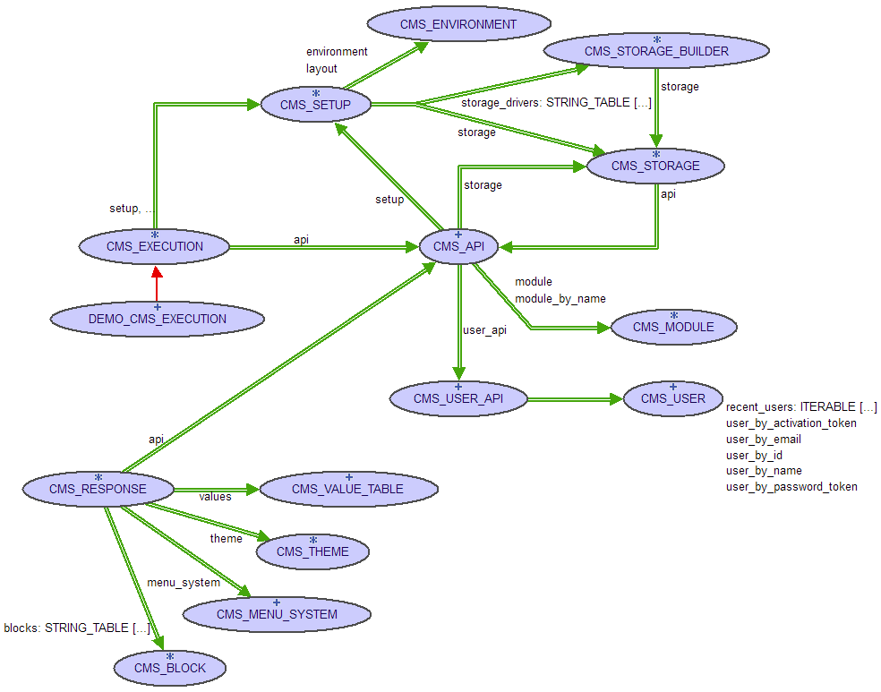

ROC CMS Documentation
=====================

[TOC]

## Overview

**ROC CMS** stands for "REST On CMS", however, until now, no particular focus was done on the REST API approach, and so far a more pragmatic approach dominated.

Part of the design is inspired by Drupal (blocks, hooks, Role-based access control, ...), and other parts related to Eiffel. Priorities, modules and related have been driven by concrete need, in order to fulfill the https://eiffel.org/ websites. Also a contribution (as student projects, or others) helped build various modules or functionality.

Currently, **ROC CMS** is a library or **framework** that provides components, tools and resources to build a CMS (Content Management System). It is not currently a CMS product, one can install and customize without any code.

Thus, it will be interesting for people willing to build a website using **Eiffel**. This will enable to reuse other Eiffel components, better integration with other Eiffel projects, and of course benefit from all the goodies of the Eiffel technologies (Eiffel language, DbC, re-usability, portability, IDE, debugger,...).

It depends on the **Eiffel Web Framework** (known as "Eiffel Web" or "EWF"), and thus can be executed as standalone, or CGI, libFCGI mode on Apache2 for instance, and on any Windows or Linux platform).

The main notions are:
- CMS Execution
- CMS APIs
- CMS Response
- CMS Modules
- CMS Hooks
- CMS Theme, blocks, links, ...

Those points will be described later in appropriated sections.

## Setup


The ROC CMS source is available either with the latest EiffelStudio release under the locations:
- $ISE_LIBRARY\unstable\library\web\cms
- or from github project https://github.com/EiffelWebFramework/ROC branch v0 for now.
```
git clone https://github.com/EiffelWebFramework/ROC -b v0
```

Note that if you use the source code from the github repository, you will need to use the latest release of EiffelStudio as it relieѕ on recent version of various libraries such as EWF, sqlite3, ....
And using the "master" branch, even the trunk version of EiffelStudio libraries. So for now, we encourage you to use the ROC CMS shipped with your EiffelStudio.

Once you have the source code, you should compile project <code>cms/example/demo/demo-safe.ecf</code> target "demo_standalone".
```
# from Command line
cd example
cd demo
ec -config demo-safe.ecf -c_compile -finalize
cp ./EIFGENs/demo_standalone/F_Code/demo.exe demo.exe
demo.exe
# or launch EiffelStudio, and open that project, compile and execute it inside the debugger for instance.
````

This demo includes all the official ROC CMS modules, files, and use libsqlite3 as default storage engine. So you should be able to execute it easily. The **standalone** target is configured to listen on port 9090 by default. (Mostly to avoid conflict on other app that my listen on port 80 or 8080).

In the directory <code>site</code> you will find all the expected files that should be in the root directory.
* config/ : it contains the various configuration files, especially the **cms.ini**.
* modules/ : files associated with each installed ROC CMS module.
* scripts/ : common scripts used mainly to initialize SQL databases.
* themes/ : folder containing the available ROC CMS themes.
* files/ : folder containing files available from the ROC CMS app.
* And also demo.ini that contains the settings for the web launcher, (in our case, the standalone Eiffel server), such as port_number.

Now that you know how to compile, execute, and see the related configuration files, let's describes the main notions of the ROC CMS, first from 
* an admin point of view (dev using ROC CMS to build its site),
* and then from a developer point of view (in case you want to contribute to ROC CMS).

## Usage

### Main entries
As a CMS administrator, you will need to setup your CMS application (here the demo example). For this purpose, the main entry points are the CMS_EXECUTION interface, and then the <code>site/</code> files (configuration, themes, templates, ...).

### CMS initialization/Execution
The `CMS_EXECUTION` interface is deferred, and your CMS application needs to inherit from it and define `setup_storage`, `initial_cms_setup` and `setup_modules`. See for instance `DEMO_CMS_EXECUTION`.

So, the descendant of `CMS_EXECUTION` (`DEMO_CMS_EXECUTION` in the example), is creating the `CMS_SETUP`, declares the available **storage** builders (for persistency), and declares the available **modules**.

#### Persistence/Storage
Depending on the **configuration**, the CMS engine will instantiate and use a specific **CMS_STORAGE** (the default is based on `Eiffel sqlite3`, otherwise `EiffelStore+MySQL` and `EiffelStore+ODBC` are available). The storage solution is used to implement the persistence layer, and thus store and load CMS data to disk, or database.

The CMS provides, for now, storage based on
* EiffelStore + MySQL
* EiffelStore + ODBC (could be used for MySQL, sqlite, SQLserver, ...)
* Eiffel sqlite3 : that one is the default storage, since it is convenient for testing, but it is recommended to use EiffelStore+MySQL in production CMS site.
A typical implementation of <code>setup_storage</code> is:
```eiffel
	setup_storage (a_setup: CMS_SETUP)
		do
			a_setup.storage_drivers.force (create {CMS_STORAGE_SQLITE3_BUILDER}.make, "sqlite3")
--			a_setup.storage_drivers.force (create {CMS_STORAGE_STORE_ODBC_BUILDER}.make, "odbc")
		end
```
And the CMS decides which storage should be used. It depends on the application configuration. See the **configuration** section.

Those data could be user information (login, email, password, ...), custom values, logs, emails, path aliases, ... and any data modules may need to store (for instance node content, for the `node` module.)

#### Modules

The `setup_module` is used to declare available **modules** (instances of `CMS_MODULE` effective types).
The modular design provides a simple way to extend or alter the CMS functionalities/behaviors.
Most of the CMS features are implemented by modules, and each module relies on the core of the CMS core.
This **core** contains the `CMS_API`, `CMS_USER_API`, and various internal mechanisms such as mailer, logger, ...

Use `setup_module (a_setup: CMS_SETUP)` to customize the `CMS_SETUP` object created by `initial_cms_setup`.
For your convenience, ROC CMS provides a `CMS_DEFAULT_SETUP` that import configuration from `site/config/cms.ini`

So far, what you need to remember is `CMS_EXECUTION` class and descendants are used to set up the ROC CMS application, for storage, modules, and also how to load configuration.

Note that a module can have 3 states:
- not installed,
- installed and enabled,
- installed and disabled.

At first, to install the modules, open your browser at location `https://hostname:port/admin/install` and click the associated button.
(Note: for new module addition, you also need to install them, using the same link, in the future, there will be a proper module management interface, in the admin front-end.)

To enable or disable a module, you will need to use the `cms.ini` configuration file, please see the **configuration** section.

Existing modules:
- **admin**: basic administration pages, to manage modules, roles, permissions, users, caches, ... (note: it is still very basic, and need effort to improve it.)
- authentication modules based on **auth**:
    - **basic_auth**: account signing using basic HTTP Authorization solution
    - **oauth20**: sign using a thirdparty OAuth2.0 account (such as Google, Facebook, github, ...)
    - **openid**: sign using an OpenID account.
- **node**: the base of node management, include **Page** content type.
- **blog**: extends the **node** module with a **blog** content type.
- **recent_changes**: compute recent changes of CMS (integration with **node** management, and any modules that implement the `CMS_RECENT_CHANGES_HOOK`).
- **feed_aggregator**: aggregate one or many feeds (rss, atom, ...), and provide associated pages or blocks.
- **google_search**: provides search facilities using the Google Custom Search API.

### Configuration
When `CMS_DEFAULT_SETUP` is used, the CMS configuration is loaded from `site/config/cms.ini`.
That file contains a few sections:
- **site**: to set the `name`, `email` and the name of the `theme`. (See "Themes" section pour information.)
- **layout**: the application layout (or environment) can precise the `root-dir`, `themes-dir`, `modules-dir`. If not defined, the values are computed from Current working directory.
- **mailer**: the CMS can send email notification for various reasons, such as new users, or reset password functionalities, ... In this section, you can use
    - `smtp` settings to precise an SMTP server (+ port), 
    - or `sendmail` to use an external script using the sendmail usage,
    - or just an `output` file such as @stderr, or a path to a file on disk.
- **modules**: used to enable or disable modules.
    - `*=on`  -> modules are enabled by default
    - `*=off` -> modules are disabled by default
    - Note the default value is `on`
    - For each module, this can be overwritten with  `module_name=on|off`
- **blocks**: settings for blocks (See Themes, Blocks sections for more information on the block). A few parameters are available to customize blocks. The general form is `block-name.param=value` (note that "foo.bar" is a value block name.)
    - `block-name.region`: assign the block `block-name` to a specific region. A block can be assigned to **only one region**.
    - `block-name.title`: used to overwrite the block title (with <none> , the title is hidden).
    - `block-name.weight`: used to order blocks in the same region (blocks with lower weight goes first).
	- `block-name.expiration`: used to provide a basic cache system based on expiration. The value is a number of seconds before the cache expires (-1: never expires, 0: never cache, n: cache expires after `n` seconds).
    - `block-name.condition`, or `block-name.conditions[]`: include `block-name` only under specific condition(s). The condition can be 
        - `is_front`: which is True only for the front page, usually at url "/"
        - `path:foo/bar`, `path:foo/*/bar`: True only for CMS location matching the patterns after "path:"
        - `<none>`: related block is disabled.
        - *note: There can be multiple conditions processed as any of the conditions (i.e: "or").*
    - `block-name.options[varname]: pass a table of options `varname => value` to the related block. This can be used to pass parameters for block builder (for instance, recent_changes modules accept parameters "size" to know how many changes should be included.)
    - To be able to include a block content into multiple region, it is possible to use aliases feature. For instance `&aliases[new_block]=block-name`, in this case, a `new_block` is declared, and it has same content as `block-name`, on this alias, the parameters `region, condition(s), title, weight` are supported, but not `options[]`.
- **admin**: various admin related settings such as
    - `installation_access` which accepts 3 values: "all", "none" or "permission", to precise who has access to the modules installation page; either "all" for anyone, "none" to disable installation of new modules, or "permission" to use the CMS permissions solution to determine if the current user can install a new module.
    
Then, the configuration `cms.ini` can also define other parameters, and sections, that may be used by specific modules.
Note it is also possible to include another ini file with instruction `@include=path-to-file.ini`.

Check the `example/demo/site/cms.ini` for example.

### User management
The CMS core includes the notion of user, via interface `CMS_USER`, which has an id, a name, a password, ... and profile. Without any module, the CMS does not include any mean to authenticate, but still the CMS has the support for user management, and permissions system for current user. To be able to sign into the CMS, the site should include the module `auth`, and one or many of:
- `basic_auth`: authentication using the HTTP Authorization header.
- `oauth20`: being able to sign with an OAuth2.0 account (such as Google, Facebook, ...)
- `OpenID`: being able to sign with an OpenID account.

Whatever authentication solution is used, when a user is signed-in, there is an instance of `CMS_USER` representing the associated CMS user account.

There is a predefined user `admin` who is the administrator of the CMS, and by definition, this **admin** has all the permissions. It is initialized by default with username `admin` and password `istrator#`.

The access control is role-based permissions system. This means, a user can have one or many *roles*, and each *role* includes a list of *permissions*.
There are two built-in roles:
- **anonymous**: when no user is signed in (typically anonymous visitors).
- **authenticated**: when a user is signed in the CMS.
With those 2 built-ins roles, and any custom role the admin will create, it is possible to give specific permissions, to a group of users. 
The CMS core defines a few permissions, and each module can also define their own permissions, for instance: "view any page", "create page", "edit page", "delete page", "clear cache", "install modules", ... (when the administrator is signed-in, go to url `/admin/role/1/edit` to see all the available permissions).

### Modules
A module is the way to extend the CMS engine.
First via the inherited `CMS_MODULE` interface that enables a module to:
- have a custom `install` and `uninstall` procedure by redefining the related routines.
- add its **routes**  via `setup_router`. (i.e associated url or template of url with a specific request handler).
- register itself to hooks via `register_hooks`.
- declare new permissions by redefining `permissions`.
- provide a specific module api by redefining `module_api`.
- add its **filters** by redefining `filters`.

Using the `hooks` system, a module can be deeply integrated with the CMS engine, and even alter behaviors (for instance, add link, add css, javascript, ...). See related developer documentation on hooks.

It is simple to create your own modules (check the developer documentation).
The ROC CMS library provides a few modules for now, for instance: basic_auth, oauth20, openid, node, blog, feed_aggregator, recent_changes, google_search, ... and others (the list keeps growing...).

**Reminder**: to include a module to your CMS site, you need to 
- include the associated .ecf file in your CMS site .ecf file.
- and also declare them in your descendant of CMS_EXECUTION.
- copy the eventual resources, configuration, ... files in the corresponding `site`.
Note: a tool **roc** is under development to ease such operations, for now it only copies needed files from module to site location. In the future, it should also update .ecf files, associated CMS_EXECUTION effective class.

### Themes
When talking about CMS, a major topic is how a request is rendered in a web browser. Here comes the notion of **theme** which is a collection of templates, accepting various values as input (including the content of the blocks), and renders as an html5 page. It also includes various assets such as css, javascript, icons, images, ...
The ROC CMS theming is inspired by Drupal, with the notion of **region** and **block**.

Note: for now, there is no simple "theme" module or similar, and the common way to start your CMS site is to copy an existing project such as the one available with the demo example (i.e: copying the source code, but also the `site` folder).

Currently the default theme  of the demo example `SMARTY_CMS_THEME` is based on Eiffel **smarty** template library (Check [smarty doc](https://svn.eiffel.com/eiffelstudio/trunk/Src/contrib/library/text/template/smarty/README.md) for syntax and functionalities).

The layout of a CMS web page has predefined area called **regions**. The Eiffel CMS uses the same default regions as Drupal, so let's see them in the following image.

```
		+----------------------------------------------------------+
		|                        Page_top                          |
		+----------------------------------------------------------+
		|                         Header                           |
		+---------------+-------------------------+----------------+
		|               |      Highlighted        |                |
		| Sidebar_first +-------------------------+ Sidebar_second |
		|               |          Help           |                |
		|               +-------------------------+                |
		|               |                         |                |
		|               |         Content         |                |
		|               |                         |                |
		+---------------+-------------------------+----------------+
		|                         Footer                           |
		+----------------------------------------------------------+
		|                      Page_bottom                         |
		+----------------------------------------------------------+
```

The regions available for a theme, are defined in a configuration file `theme.info` located in the theme directory. For example:
```
name=default_theme
engine=smarty
version=0.1
regions[page_top] = Top
regions[header] = Header
regions[content] = Content
regions[highlighted] = Highlighted
regions[help] = Help
regions[footer] = Footer
regions[sidebar_first] = first sidebar
regions[sidebar_second] = second sidebar
regions[page_bottom] = Bottom
```
Note: the value for each region is the human readable region name.

Note the regions may be disposed with other layout (two sidebars on the left, or right, ... and so on), responsive design or not, and so on. But on the CMS side, a *block* can be inserted into a *region*, and depending if the region is included in the theme, the related block content will be displayed or not.
To sort *block* inside a region, the CMS is using the `weight` property (that can be set via code, and/or overridden via configuration, i.e: `cms.ini`).
This is how a site can support many themes, using the region as content holders, and theme for the layout and style.

Internally the block contents are stored in the values associated with each region.
The theme also has access to specific `values` such as
- `site_url`: the absolute url of the CMS website.
- `host`: the host name.
- `is_https`: True if the connection is using https://
- `user`: contains the username of the signed user, if any.
- `site_title`: site title.
- `page_title`: per page title.
- and also `page: CMS_HTML_PAGE` which represents the CMS page to render with the theme.
    - `page` provides values via expression, such as `$page.type`, `$page.is_front`, `$page.is_https`, `$page.title`, ...
    - and also a smart expression for region via `$page.region_xyz` for region `xyz` if any, ... (note the region are also available with expression like `$region_xyz` or `$page.region_xyz` ...)

==Note for developers: internally, the deferred class `CMS_RESPONSE` provides an abstraction to render the response for the request using the **theme**, in fact, the theme is controlled by the CMS_RESPONSE implementation (to set value, build expected theme, and finally render as html).==

### Blocks
As previously said, a region holds smaller piece of content called blocks.
Blocks hold chunks of content, like the user login form, navigation menu, information for the footer, or anything provided by each module.
For instance the `feed_aggregator` module provides a block to display the latest elements of a aggregated feed.

Currently there are different kind of `CMS_BLOCK`:
- `CMS_CONTENT_BLOCK`: it holds a simple text to render as it is on the page.
- `CMS_MENU_BLOCK`: it holds a `CMS_MENU` as a collection of `CMS_LINK` generally used to hold a menu, or set of links such as navigation or management menus.
- `CMS_SMARTY_TEMPLATE_BLOCK`: it holds a simple text to render as it is in the page.

Internally, there are two other kinds of block:
- `CMS_ALIAS_BLOCK`: being the alias of another block, but with specific properties.
- `CMS_CACHE_BLOCK`: there is a simple cache solution for blocks, based on expiration. See the configuration section to know how to define the expiration for a block.

For now, creating a block is only possible via block, an evolution of ROC CMS should allow the administrator to add new block without coding.

### Persistence
The persistence or storage layer is used by the CMS to store custom values, path aliases, logs, emails, user information, but it is also used by module (unless a module wants to use its own persistence solution, disk, cloud, ...).

Currently, there are only SQL based implementations of that `CMS_STORAGE`, but nothing prevents to implement it with other solutions (plain text file, NoSQL db, ...).
The current implementation are using either:
- EiffelStore + MySQL: recommended for production, however Eiffel MySQL requires to configure your environment by setting, for instance MYSQL variable on Windows, and MYSQLINC on Linux.
- EiffelStore + ODBC: via ODBC, there is a large range of available database (MySQL, SQLite, SQLserver, ...), but it requires to set up your environment (for instance install sqliteODBC driver to use SQLite database).
- Eiffel sqlite3 wrapper: it is very convenient for development, but maybe not recommended for production websites. It does not require any environment setup, so this is a simple solution to build tests for instance.

In practice, how to use a storage or another?
The project needs to include the expected storage, the following instructions explains how to include sqlite3, EiffelStore+ODBC and EiffelStore+MYSQL storage.
1. First the associated .ecf file need to be included in your project file (.ecf)
For instance
```xml
<library name="persistence_sqlite3" location="$ISE_LIBRARY\unstable\library\web\cms\library\persistence\sqlite3\sqlite3-safe.ecf"/>
<library name="persistence_store_odbc" location="$ISE_LIBRARY\unstable\library\web\cms\library\persistence\store_odbc\store_odbc-safe.ecf"/>
<library name="persistence_store_mysql" location="$ISE_LIBRARY\unstable\library\web\cms\library\persistence\store_mysql\store_mysql-safe.ecf"/>
```
2. Then in the descendant of `CMS_EXECUTION`, in the demo `DEMO_CMS_EXECUTION`, see the code of `setup_storage`:
```eiffel
setup_storage (a_setup: CMS_SETUP)
	do
		a_setup.storage_drivers.force (create {CMS_STORAGE_SQLITE3_BUILDER}.make, "sqlite3")
		a_setup.storage_drivers.force (create {CMS_STORAGE_STORE_MYSQL_BUILDER}.make, "mysql")
		a_setup.storage_drivers.force (create {CMS_STORAGE_STORE_ODBC_BUILDER}.make, "odbc")
	end
```

3. And finally, in the configuration file `site/config/demo.json` (in fact, the executable name + ".json"), define the driver and environment of the datasource. For instance the following code defines **sqlite3** as default CMS storage, and environment *sqlite3* that defines the path of SQLite database as "site/database.sqlite3". Note the way to declare sqlite with ODBC, mysql with ODBC, or mysql directly with EiffelStore.
```json
{
	"database": {
		"datasource": {
			"driver": "sqlite3",
			"environment": "sqlite3",
		},
		"environments": {
			"sqlite3": {
				"connection_string":"Database=./site/database.sqlite3;"
			},
			"odbc-sqlite": {
				"connection_string":"Driver=SQLite3 ODBC Driver;Database=./site/database.sqlite;LongNames=0;Timeout=1000;NoTXN=0;SyncPragma=NORMAL;StepAPI=0;"
			},
			"odbc-mysql": {
				"connection_string":"Driver=mysql ODBC Driver;Server=localhost;Port=3306;Database=roc;Uid=roc;Pwd=roc;"
			},
			"mysql": {
				"connection_string":"Driver=mysql;Server=localhost;Port=3306;Database=roc;Uid=roc;Pwd=roc;"
			}
		}
	}
}
```
To use EiffelStore+MySQL, just change the "driver" to be "mysql" and "environment" to "mysql". The connection string for server database defines the credentials with "Uid" and "Pwd".

### How to run the CMS site?
As any Eiffel Web application (EWF), it can be executed as 
- **standalone**: using Eiffel standalone httpd server included in the "standalone" connector, and then no setup is needed.
- **CGI** or **libFCGI** server: using, for instance, Apache2. Please refer to the Eiffel Web Framework documentation.

### Conclusion
At this point, you know enough to build and administrate a ROC CMS site.
However, for a real site, it is likely that you will need to build your own modules, you will learn how doing that in the Developer Documentation.

***
## Developper Documentation

This diagram shows the main interfaces, they will be described in this documentation, but for now, it introduces those class names.





### CMS APIs
An instance of CMS_API is available either via argument, or via attribute / function of various CMS components.
It provides routine specific to the ROC CMS engine (access to setup, modules, logs, custom values, ...).

### CMS Hooks
Hooks is a mechanism which provides a way for modules to interact with each other and extending blocks of the current CMS.

- [CMS_HOOK](../library/src/hooks/cms_hook.e): deferred class CMS_HOOK is a marker interface for CMS Hook
- [CMS_HOOK_AUTO_REGISTER](../library/src/hooks/cms_hook_auto_register.e): when inheriting from this deferred class, the declared hooks are automatically registered (note only the CMS core hooks are supported, as opposed to hook a module may propose). Otherwise, each descendant has to register itself to the associated hook manager.
- [CMS_HOOK_BLOCK](../library/src/hooks/cms_hook_block.e): it provides a way to declare and build blocks.
- [CMS_HOOK_FORM_ALTER](../library/src/hooks/cms_hook_form_alter.e): it provides a way to alter a web form `CMS_FORM`.
- [CMS_HOOK_MENU_ALTER](../library/src/hooks/cms_hook_menu_alter.e): it provides a way to alter a menu, and thus add or remove a link. This is how a module can add a link into a specific `CMS_MENU`.
- [CMS_HOOK_MENU_SYSTEM_ALTER](../library/src/hooks/cms_hook_menu_system_alter.e): similar to CMS_HOOK_MENU_ALTER, but on built-in menu, such as management, navigation menus, and other.
- [CMS_HOOK_VALUE_TABLE_ALTER](../library/src/hooks/cms_hook_value_table_alter.e): it provides a way to alter the values table for a response (i.e: inserting custom values, or even override existing values).
- [CMS_HOOK_EXPORT](../library/src/hooks/cms_hook_export.e): it provides a simple export solution for each module. Typically used to archive data associated with a module, for instance for backup purpose. In the future, a `CMS_HOOK_IMPORT` should also be available, and it would allow importing data exported by `CMS_HOOK_EXPORT`.
- and for more hooks ... please check descendants of `CMS_HOOK`.

### Custom Module
How to build a new module?
A module is usually developed as an Eiffel library, and provide one or many implementations of `CMS_MODULE`.
It has to set or implement:
- **name**: a unique name identifying the module
- **description**: a human text to describe the purpose of the module, it will mainly be used by the administration front-end.
- **package**: put the current module into a package, mainly for admin front-end.
- **version**: version information
- **dependencies**: defines dependencies on other modules.
- **permissions**: defines permissions used by the modules (mainly for admin front-end)
- **setup_router**: associate routes with request handlers (declare various url or url template and associated request handler).
- **filters**: similar to routers setup, but for WSF Filters (See EWF documentation for more details).
- **register_hooks**: register current module with various hooks if needed.

A module can also redefine `install` and `uninstall`. This could be used during installation to create new database tables, or anything needed by the module, or clean similar resources when being uninstalled.

In addition, a module can also implement `module_api: detachable CMS_MODULE_API` in order to be integrated easily with other modules (see for instance the CMS_NODE_API defined in **node** module).

Please have a look at the [tutorial](tutorial.md) page.

## References
For the interface references, please have a look at the [ROC CMS source code](https://github.com/EiffelWebFramework/ROC).

***
*(last modified: Nov/17/2015 by Jocelyn.)*
